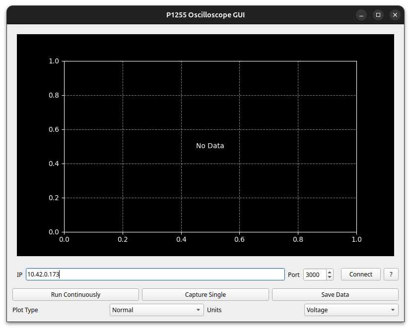
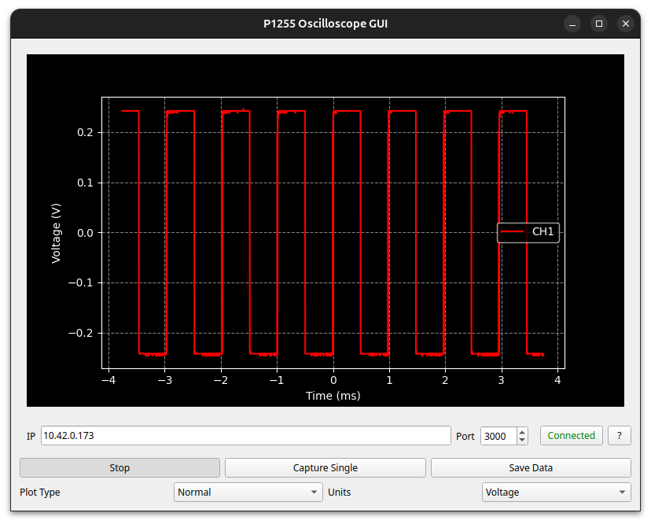

# Peaktech P1255

Peaktech P1255 open-source data acquisition software

This software can query data from the Peaktech P1255 oscilloscope via LAN, decode and export the data. It can be installed via pip:

```bash
pip install p1255
```
and it provides two executables: `peak-view` is a GUI application to view and export data and `peak-capture` is a command line tool to grab data and save it to a file.
Use `peak-capture --help` to see all available options.

## Connection

The network configuration for the oscilloscope needs to be done on the device itself. The device does not support DHCP, so you need to set a static IP address.

### IPv4 LAN

The Oscilloscope is connected to a network via a LAN cable. The network interface provides an IPv4 TCP/IP socket, listening on port 3000 on the device. Unfortunately these devices do not support DHCP, so the network settings need to be done manually:
- Press the "utility" button on the oscilloscope
- Press the "H1" button to access the possible menus
- Scroll down to "LAN Set" by rotating the "M" knob
- Press the "M" knob to enter the menu
- Press on the "H2" Button ("Set")
- You can use The "F*" buttons and the "M" knob to adjust all settings in this menu.
- Don't forget to save the changes. Restart the device to apply the changes.

### IPv6

**There is no information about IPv6 support available**

## Usage 

### GUI 

The GUI can be started in various modes. By default, the software starts with a free input field for the IPv4 address and the port of the oscilloscope in the network.

*Fig. 1*: Start Screen of the GUI.  
                    

By inserting the IPv4 address of the device and clicking on the connect-Button the software connects to the oscilloscope. 


*Fig. 2*: Start Screen of the GUI.  
                    

When the software is connected to the oscilloscope, pressing the “Run Continuously” or “Capture Single” buttons will start the visualization of the current oscilloscope display in the software.

When both channels are connected, both channels are displayed and XY-mode can be activated.

By Changing from "Voltage" to "Divisions" it is possible to get the identical Y-scale as on the oscilloscope display.

To Save the data, just click on the "Save Data" button, the data can be saved as .csv, .json and .npz file format.

### Command Line

The software can also be started by the command line, if the software is installed system-wide or started inside a Virtual Environment.

An example for capturing, decoding and exporting the data as a .csv-file: 
```bash
peak-capture -a 10.42.0.173 -o ~/data.csv -f csv
```
The command `peak-capture --help`  also provides assistance.